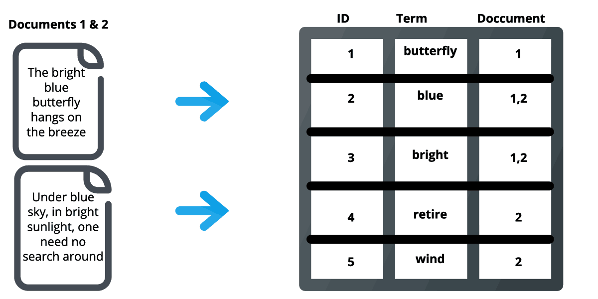

<template v-slot:left>

# What is an `index`?

`index`ing is a mechanism which organizes data and helps with faster retrieval.

We have different forms of `index`ing in our day-to-day life, some of them

1. Database-indexing -> In a **database**, an **index** is a data structure that enhances the speed and efficiency of specific operations,
such as searching for data within columns or tables. Indexes are commonly used in relational databases (e.g., SQL) to optimize query performance.
2. File indexing -> **Operating System(s) OS** uses these indices to locate files quickly.
It stores metadata like `filename`, `file-location` and `file-size`
3. Programming indexing
  - `hash-map` / `vector` in `clojure`
  - `dictionary` / `list` in `python`
  - `object` / `array` in `javascript` where the value is retrieved based on the identifier [position / indexName]
etc.,

</template>

<template v-slot:right>

# `elastic-index`
w.r.t `elastic` an `index` is collection of `document` which share similar characteristics. This is the highest level entity used
for querying aginst in `elastic`, `document`(s) in an `index` are _logically related_

# `inverted-index`

Generally the naming is very clear it the _inversion of `index`_ meaning, within an `index` we can
find collection of documents and given some value from `document` to identify the `document` inversion-of-index
will be really helpful. Where `elastic` stores the _logical relationship_ between values and document in `inverted-index`

 

</template>
