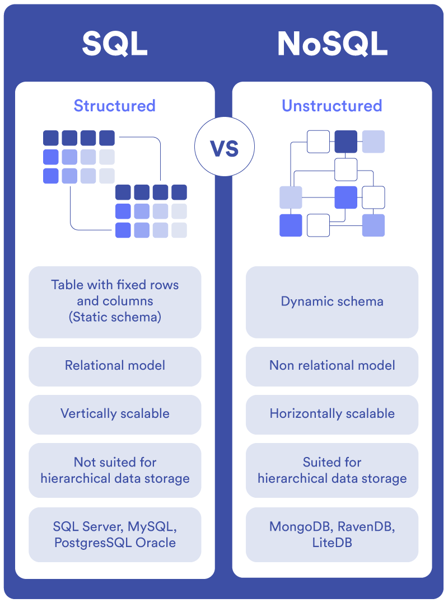

<template v-slot:default>

## What is `elastic`?

> `elastic` is a _search, logging, cyber security, observability, analytics, and generative AI use cases_

alike `postgres` even `elastic` is a database which stores
the data in a _denormalized JSON_ format. meaning
it follows `NoSQL` pattern for data validation.

</template>

<template v-slot:right>

## NoSQL ?

`NoSQL`is an _"approach"_ where data are stored and queried in a _"non-structured"_ manner
It tends to avoid _relationships_ between data (_traditional tabular-relations (or) relational databases)

## references

</template>
