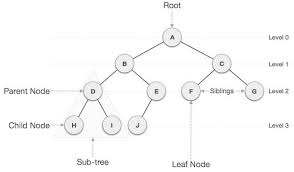

<template v-slot:header>

# How `pgsync` functions

* `pgsync` is a _live running service_, i.e., its required for it to keep running
for the real-time synchronization

* `pgsync` is written in `python`

* `pgsync` process is two fold
  * `bootstrap`_ping_
  * `pgsync`_ing_

</template>

<template v-slot:left>

## What is bootstraping?

`bootstraping` is the process of making sure the `schema` defined is as per `database` table design

### How `pgsync` bootstraps?

* in order to `pgsync` to bootstrap it requires a `configuration` called `schema`

* this `schema` is defined in `JSON` format

* the structure of schema is generic which allows de-normalizing `relational-records`
into `denormalized-value`

* `pgsync` leverages `tree` datastructure for handling this normalization to denormalization

</template>

<template v-slot:right>

## What is syncing?

`sync`_ing_ is the actual BAU behind `pgsync` to get `real-time` updates from `postgres` => `elastic` / `opensearch` 

### How `sync` from postgres happens

* `pgsync` leverages all native functionalities of `postgres` to keep them records in _sync_, they are:

  1. Write-Ahead-Log (`WAL`) -> **required** setting in `postgres`
    a. `replication-slot`
  2. triggers
  3. async notification channel

#### WAL

`postgres` inherently promises being _fault tolerant_ + _failure tolerant_, meaning the data is
both `consistent` and `reliable`, to achieve the same `postgres`'s uses WAL
which is a `log-file` that has depth configuration

#### Trigger

`trigger` is an native event-driven callback that is invoked from `postgres` on specific 
event occuring like `CREATE` / `UPDATE` / `DELETE` etc.,

#### Async notification channel

`channel` is a _tunnel_ which postgres uses to push information to the client
asynchronously without blocking I/O and buffering the events out

</template>

